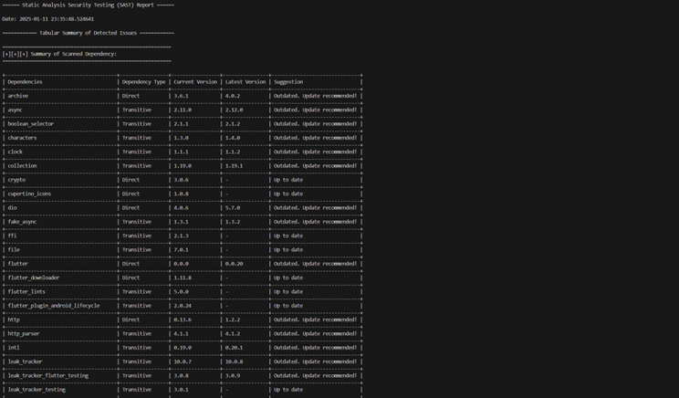
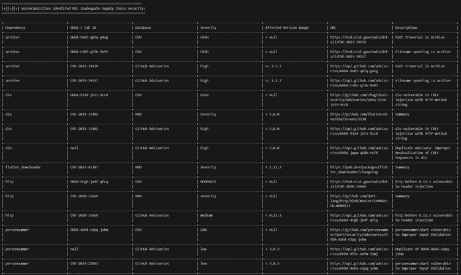
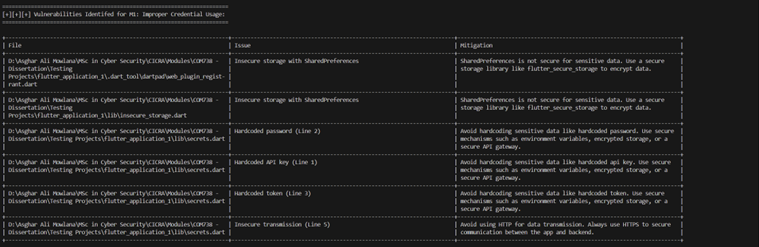
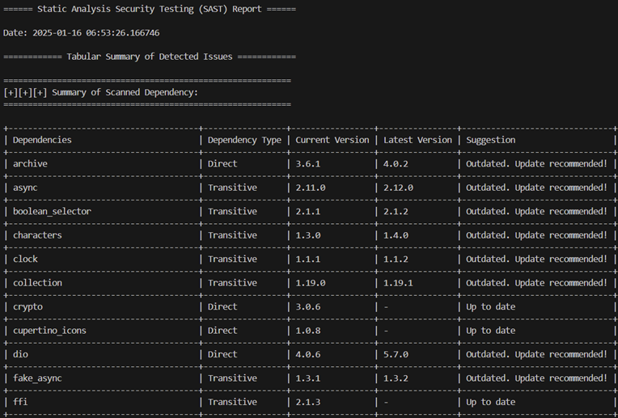

# FLUTTER SENTINEL USER MANUAL

## 1. PRE-REQUISITES

1. Dart SDK: This is required to run the tool. Follow the instructions on the ‘dart.dev’ web page and install the Dart SDK (https://dart.dev/get-dart).
2. Git: This is required to clone the tool from GitHub. Download and install git from the ‘git-scm’ wep page (https://git-scm.com/downloads).

## 2. TOOL SETUP

1. Navigate to a folder where the tool should be installed.
2. Execute the command ‘git clone https://github.com/Asghar-Ali-Mowlana/flutter_sentinel.git’ to get the tool from GitHub.

## 3. SCANNING TYPES

There are three types of scanning that this tool can perform:
1.	Dependency Scan
2.	Custom Scan
3.	Full Scan

### 3.1 DEPENDENCY SCANNING

In this type of scanning all the dependencies both direct and transitive in the pubspec.lock file will be scanned for any latest versions available and any already reported vulnerabilities from the below databases:
•	OSV (Open Source Vulnerability)
•	NVD (National Vulnerability Database)
•	GitHub Adversary Database.

### 3.2 CUSTOM SCANNING

In this scan all the dart files in the lib directory and its sub directories will be scanned for the OWASP Mobile Top 10 issue:
•	M1: Improper Credential Usage
•	M2: Inadequate Supply Chain Security
•	M3: Insecure Authentication/Authorization
•	M4: Insufficient Input/Output Validation
•	M5: Insecure Communication
•	M6: Inadequate Privacy Controls
•	M7: Insufficient Binary Protections
•	M8: Security Misconfiguration
•	M9: Insecure Data Storage
•	M10: Insufficient Cryptography

### 3.3 FULL SCANNING

In this type of scanning both the dependency scan and the custom scan will be performed together and the generated SAST report will display the details in a tabular format.

## 4. FLUTTER SENTINEL USAGE

Given below are the commands to perform each type of scan separately.
1.	Dependency Scan
    -	dart run bin/flutter_sentinel.dart --ds

2.	Custom Scan
    -	dart run bin/flutter_sentinel.dart --cs

3.	Full Scan
    -	dart run bin/flutter_sentinel.dart

## 5. REPORT DETAILS

Given below are example outcomes of each type of scan and the details included in the generated report.

### 5.1 DEPENDENCY SCANNING REPORT

The initial table displays the summary of the scanned dependencies will be displayed in a tabular format. The summary will include details related to: 
•	Dependency types on whether the particular dependency is a direct or indirect dependency.
•	The current and latest version of the dependency. 
•	Suggestion on whether the dependency is outdated or up to date.

The next table will include the details regarding inadequate supply chain security (M2) which will primarily include details on the vulnerabilities of the dependencies used. It will specifically include details on:
•	Name of the Dependency
•	GHSA (GitHub Security Advisory) / CVE (Common Vulnerabilities and Exposures) ID
•	Vulnerability Database
•	Severity
•	Affected Version Range
•	URL
•	Description

### 5.2 CUSTOM SCANNING REPORT

In this scan the table displays the details regarding identified vulnerabilities related to OWASP mobile top 10 will be included in the application. The tabular structure and the details included in it are all same for M1, M3, M4, M6, M8, M9 and M10
•	File: The name and location of the file.
•	Issue: The identified issue and the line number.
•	Mitigation: Details related to mitigating the issue.

### 5.3 FULL SCANNING REPORT

This report generated will include both the details on the dependency scan and custom scan.

